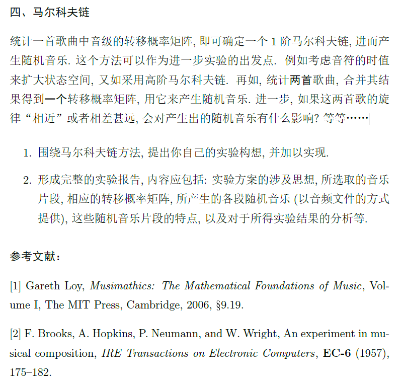

# 音数小组作业代码部分

此部分为音数小组作业代码部分，由潘昭恺（@pzk23）和王子谦（@zqi-wong）负责。

## 音乐相关

[题目要求](./file/projects22b(1).pdf).


统计含时长和音高的结果。
关于音高都提供半音差。

## 代码与代码结构

计划使用Matlab.
使用json转移矩阵。暂时只考虑一阶。

### 工具库

使用工具库JSONlab([GitHub地址](https://github.com/fangq/iso2mesh#fork-destination-box),[下载地址](https://iso2mesh.sourceforge.net/cgi-bin/index.cgi?jsonlab/Download),[相关使用](https://blog.csdn.net/qq_21449473/article/details/123183670))

使用工具库miditoolbox([GitHub地址](https://github.com/miditoolbox/1.1),[文档地址](./file/MIDItoolbox1.1_manual.pdf))

以上工具库皆需在Matlab中读取为路径。

### 外部接口

（暂不考虑与midi交互？）使用json获取按时序的音符。从文件夹./input中获取。
notes.json每行结构为\[duration_beat,pitch\]，其中pitch为0代表空，其他的则与scale.json中一一对应。
scale.json结构为\[pitch1,pitch2,...\],每个为与主音之半音差。

作为示例：
notes.json

```json
[
    [1,1],
    [0.5,2],
    [0.5,3]
]
```

scale.json

```json
[
    -2,0,2
]
```

输出midi文件.输出在./output中

### 内部接口

见./dev.md

### 使用

主函数main.m
matlab命令行中运行脚本。

## 其它问题

输出结果如何标号？是否按小节考虑输出？是否输出一些和弦做背景？

多乐谱统计？midi统计？多声部统计？
